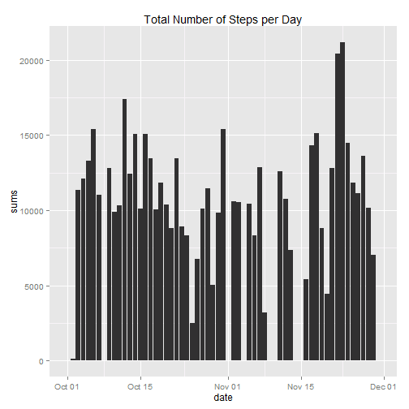

# Reproducible Research: Peer Assessment 1

## Loading and preprocessing the data
Load the data into the data table "activity". If the data file does not exists, download, unzip and then load it, and record the date when for when the file was downloaded. When loading, let the first and third columns be Integer type, and the second column be a Date type.


```r
if (!file.exists("activity.csv")) {
    date()
    setInternet2(use = TRUE)
    fileUrl <- "https://d396qusza40orc.cloudfront.net/repdata/data/activity.zip"
    download.file(fileUrl, destfile = "./activity.zip")
    unzip("activity.zip")
    date()
}

activityCols <- c("integer", "Date", "integer")
activity <- read.csv("activity.csv", na.string = "NA", colClasses = activityCols)
```


## What is mean total number of steps taken per day?
- Make a histogram of the total number of steps taken each day


```r
library(ggplot2)
```

```
## Warning: package 'ggplot2' was built under R version 3.0.3
```

```r
totalStepsPerDay <- rowsum(activity$step, activity$date, na.rm = TRUE)
histData <- data.frame(date = as.Date(rownames(totalStepsPerDay)), sums = totalStepsPerDay)
qplot(date, sums, data = histData, stat = "identity", geom = "bar") + labs(title = "Total Number of Steps per Day")
```

 


- Calculate and report the mean and median total number of steps taken per day

```r
options(scipen = 1, digits = 2)
meanSteps <- round(mean(totalStepsPerDay))
medianSteps <- round(median(totalStepsPerDay))
```


### The mean steps is 9354. The median steps is 10395.

## What is the average daily activity pattern?
- Make a time series plot (i.e. type = "l") of the 5-minute interval (x-axis) and the average number of steps taken, averaged across all days (y-axis)


```r
avgStepsPerInt <- aggregate(activity$steps, by = list(activity$interval), FUN = "mean", 
    na.rm = TRUE)
names(avgStepsPerInt) <- c("interval", "averageSteps")
qplot(interval, averageSteps, data = avgStepsPerInt, geom = "line") + labs(y = "average steps", 
    title = "Average Number of Steps per Interval")
```

 


- Which 5-minute interval, on average across all the days in the dataset, contains the maximum number of steps?

```r
maxIntSteps <- which.max(avgStepsPerInt$averageSteps)
maxInt <- avgStepsPerInt$interval[maxIntSteps]
```


### On average, the 835 5-minute interval contains the maximum number of steps.

## Imputing missing values


- Calculate and report the total number of missing values in the dataset (i.e. the total number of rows with NAs)

```r
numMissing <- sum(complete.cases(activity) == FALSE)
```


### The number of rows with missing values is 2304.

- Devise a strategy for filling in all of the missing values in the dataset. The strategy does not need to be sophisticated. For example, you could use the mean/median for that day, or the mean for that 5-minute interval, etc.

- Create a new dataset that is equal to the original dataset but with the missing data filled in.

### Imputing Strategy: replace NA values with the mean number of steps for the corresponding 5-minute interval.

```r
newActivity <- activity
newActivity$steps[is.na(newActivity$steps)] <- sapply(newActivity$interval[is.na(newActivity$steps)], 
    function(x) avgStepsPerInt$averageSteps[avgStepsPerInt$interval == x])
```


- Make a histogram of the total number of steps taken each day and Calculate and report the mean and median total number of steps taken per day. Do these values differ from the estimates from the first part of the assignment? What is the impact of imputing missing data on the estimates of the total daily number of steps?

```r
totalStepsPerDay2 <- rowsum(newActivity$step, newActivity$date, na.rm = TRUE)
histData2 <- data.frame(date = as.Date(rownames(totalStepsPerDay2)), sums = totalStepsPerDay2)
qplot(date, sums, data = histData2, stat = "identity", geom = "bar") + labs(title = "Total Number of Steps per Day")
```

 

```r
meanSteps2 <- round(mean(totalStepsPerDay2))
medianSteps2 <- round(median(totalStepsPerDay2))
```


### The mean steps per day for the imputed data is 10766 and the median is 10766. Imputing missing data raised the estimates and made them more equivalent.

## Are there differences in activity patterns between weekdays and weekends?
For this part the weekdays() function may be of some help here. Use the dataset with the filled-in missing values for this part.

- Create a new factor variable in the dataset with two levels - "weekday" and "weekend" indicating whether a given date is a weekday or weekend day.


```r
newActivity$day <- as.factor(weekdays(newActivity$date))
levels(newActivity$day) <- list(weekday = c("Monday", "Tuesday", "Wednesday", 
    "Thursday", "Friday"), weekend = c("Saturday", "Sunday"))
```


- Make a panel plot containing a time series plot (i.e. type = "l") of the 5-minute interval (x-axis) and the average number of steps taken, averaged across all weekday days or weekend days (y-axis).


```r
avgStepsPerIntDay <- aggregate(newActivity$steps, by = list(newActivity$interval, 
    newActivity$day), FUN = "mean", na.rm = TRUE)
names(avgStepsPerIntDay) <- c("interval", "day", "averageSteps")
qplot(interval, averageSteps, data = avgStepsPerIntDay, geom = "line") + facet_wrap(~day, 
    ncol = 1) + labs(y = "Average Number of Steps", x = "Interval", title = "Average Number of Steps per Interval by Day")
```

 

